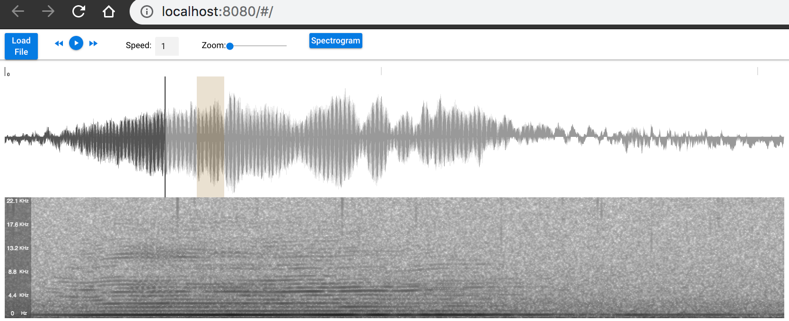

# sgn.player

A basic audio visualizer/player based on [WaveSurfer](https://wavesurfer-js.org)
and [Quasar](https://quasar.dev).
Initial setup of this project was done basically by following this [dev.to article](
https://dev.to/johnnymakestuff/how-to-build-a-soundcloud-like-audio-player-app-with-vuejs-quasar-and-wavesurfer-5bic)
(here, not as a cordova-based mobile version, but as a regular webapp),
and then adding some WaveSurfer plugins.

**Status**

- timeline: ok
- regions: basic functionality ok
- spectrogram: basic functionality ok
- scrolling gets pretty slow along with spectrogram
- WaveSurfer spectrogram plugin seems rather limited

### Running

    yarn
    quasar dev
    

